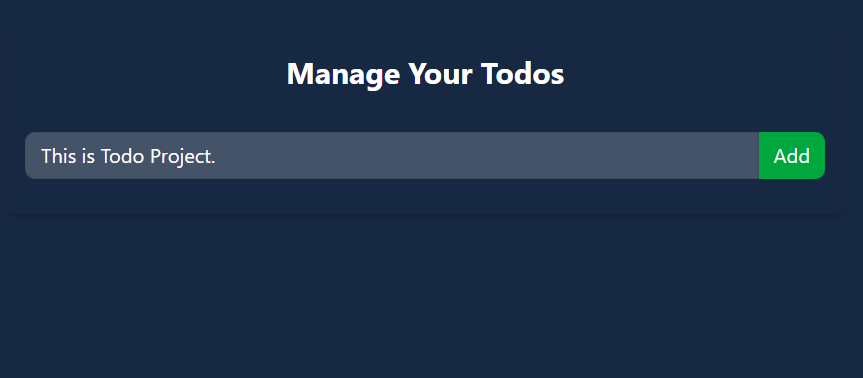
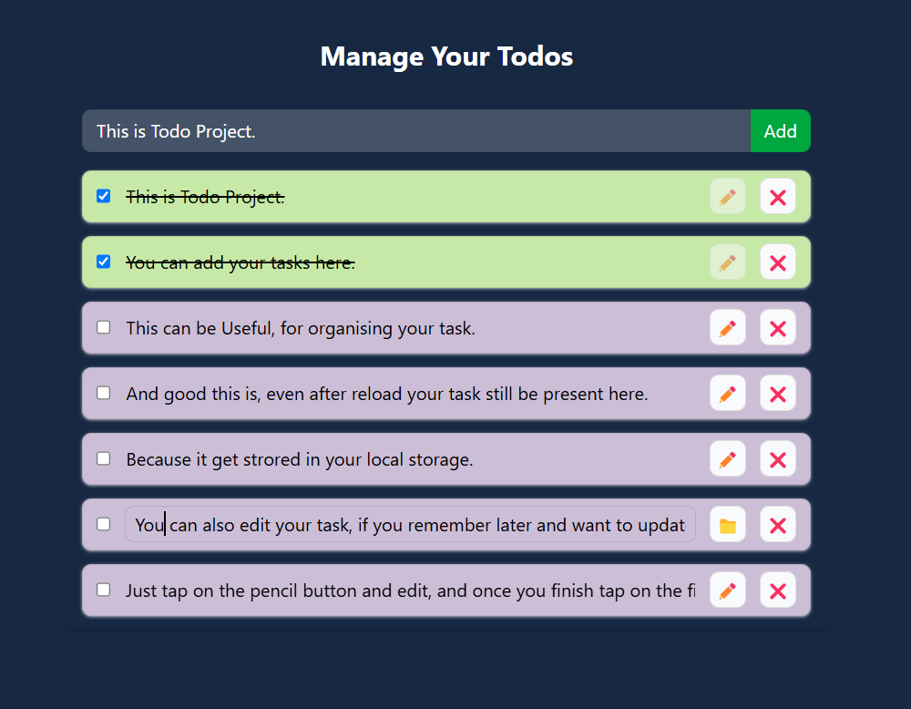

# ✅ Todo List Web App

# Live Demo 
https://todo-list-coral-nu.vercel.app/

## 🚀 Overview
This is a sleek and intuitive Todo List web application built with **React, Tailwind CSS, and Context API**. It offers a smooth task management experience with features like **persistent storage, task editing, and task deletion**. Whether you're organizing your day or planning long-term projects, this app has got you covered! ✨

## 🌟 Features
- 📝 **Add Tasks:** Easily add new tasks to your list.
- ✅ **Mark as Completed:** Tasks can be checked off when done (strikethrough effect included!).
- 💾 **Persistent Storage:** Tasks stay saved even after page refresh using **Local Storage**.
- ✏️ **Edit Tasks:** Modify tasks anytime, even after adding them.
- ❌ **Delete Tasks:** Remove tasks when no longer needed.

## 🖼️ Screenshots



## 🛠️ Technologies Used
- ⚛️ React.js
- 🎨 Tailwind CSS
- 🔄 Context API
- 💾 Local Storage (for data persistence)

## 🛠️ Installation & Setup
1. Clone the repository:
   ```bash
   git clone https://github.com/your-username/todo-app.git
   cd todo-app
   ```
2. Install dependencies:
   ```bash
   npm install
   ```
3. Start the development server:
   ```bash
   npm start
   ```
4. Open your browser and go to `http://localhost:3000/`

## 📂 Project Structure
```
📦 todo-app
 ┣ 📂 src
 ┃ ┣ 📂 components
 ┃ ┃ ┣ 📜 TodoItem.js
 ┃ ┃ ┣ 📜 TodoList.js
 ┃ ┃ ┣ 📜 TodoForm.js
 ┃ ┣ 📂 context
 ┃ ┃ ┣ 📜 TodoContext.js
 ┃ ┣ 📜 App.js
 ┃ ┣ 📜 index.js
 ┣ 📜 package.json
 ┣ 📜 README.md
```

## 🎯 Usage Guide
1. ➕ **Add a task:** Type your task and hit the "Add" button.
2. ✅ **Complete a task:** Click the checkbox to mark it as done (it'll be crossed out).
3. ✏️ **Edit a task:** Click the pencil icon to modify your task.
4. ❌ **Delete a task:** Click the red cross (❌) button to remove it.
5. 🔄 **Persistence:** Even if you refresh the page, your tasks remain saved!


## 📜 License
This project is **open-source** and available under the [MIT License](LICENSE). Feel free to contribute and improve it! 🚀

